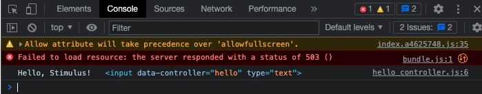

# StimulusJS-notes 📝

what it actually is? 

It will help you add some events and behaviours to your web projects without using big frameworks available.

Stimulus is described as "A modest JavaScript framework for the HTML you already have." To be more precise, **it’s a way to add JavaScript behavior to your  HTML** in a structured and consistent way.

It doesn’t seek to take over your entire front-end —in fact, **it’s not concerned with rendering HTML at all.** Instead, **it’s designed to augment your HTML** with just enough behavior to make it shine. ✨

Stimulus doesn’t bother itself with creating the HTML. Rather, **it attaches itself to an existing HTML document.** That means adding a CSS class that hides an element or animates it or highlights it, rearranging elements in groupings, manipulating the content of an element or transform UTC times.

There are cases where you’d want Stimulus to create new DOM elements, and you’re definitely free to do that. We might even add some sugar to make it easier in the future. But it’s the minority use case. **The focus is on manipulating, not creating elements.**

This makes Stimulus very different from the majority of contemporary JavaScript frameworks. **Almost all are focused on turning JSON into DOM elements via a template language of some sort.**

Stimulus also differs on the question of **state.** Most frameworks have ways of maintaining state within JavaScript objects, and then render HTML based on that state. Stimulus is the exact opposite. **State is stored in the HTML, so that controllers can be discarded between page changes,** but still reinitialize as they were when the cached HTML appears again.

### Key concepts 🔑

- We need 3 things to make this happen and we can remember them easily with this accronym CAT 🐈.

    - **c**ontroller `data-controller`
    - **a**ction     `data-action` 
    - **t**arget     `data-target` 

- Organize your JS code into dedicated controller.js files

- No need to write `querySelector` or `eventListener` again! you will bind HTML elements by using `data-attributes` instead; CAT will arrange them all.


## Introduction

You can think of it this way: just like the `class` attribute is a bridge connecting HTML to CSS, Stimulus’s `data-controller` attribute is a bridge connecting HTML to JavaScript.

If you don't want to install anything you can user a web tool

[Boiler plate to play with StimulusJS online](https://glitch.com/edit/#!/import/git?url=https://github.com/hotwired/stimulus-starter.git)

And if you are willing to clone here is the guideline:

```bash
$ git clone https://github.com/hotwired/stimulus-starter.git
$ cd stimulus-starter
$ yarn install
$ yarn start
```

### Controllers

It all starts with HTML so create an element within the body of your `index.html`

```bash
<div>
  <input type="text">
  <button>Greet</button>
</div>
```

At its core, Stimulus’s purpose is to automatically connect DOM elements to JavaScript objects. Those objects are called `controllers`. 

Create a file named `hello_controller.js` within controllers directory and add the following code.

```bash
// src/controllers/hello_controller.js
import { Controller } from "@hotwired/stimulus"

export default class extends Controller {
}
```

The way StimulusJS will bridge between HTML and Stimulus controllers is by seeking the identifier `hello`. By doing so Stimulus to create an instance of the controller class in `hello_controller.js`.

Add `data-controller="hello"` to the `<div>` form.

```bash
<div data-controller="hello">
  <input type="text">
  <button>Greet</button>
</div>
```

Next up we need to make sure the controller is working and we can use the next method in order to display something in the console and the current `element`.

Don't forget to reaload 🔁. (`connect()` is mostly used to make sure the connection is ready also keep in mind that `controllers` give behavior to you HTML element) 

```bash
// src/controllers/hello_controller.js
import { Controller } from "@hotwired/stimulus"

export default class extends Controller {

  connect() {
    console.log("Hello, Stimulus!", this.element)
  }
}
```

Example:



## Actions

Let's start by renaming the `connect` method to `greet`

```bash
// src/controllers/hello_controller.js
import { Controller } from "@hotwired/stimulus"

export default class extends Controller {

  greet() {
    console.log("Hello, Stimulus!", this.element)
  }
}
```

As we want to call the `greet()` method when the button’s `click` event is triggered. 

Add the following `data-action` attribute to the form.

```bash
<div data-controller="hello">
  <input type="text">
  <button data-action="click->hello#greet">Greet</button>
</div>
```

If we break down the `data-action` would be something like this:

- `click` is the event name
- `hello` is the controller identifier
- `greet` is the name of the method to invoke

[Here more actions available!](https://stimulus.hotwired.dev/reference/actions) (click, submit, toggle, change)


We’ll finish the exercise by changing our action to say hello to whatever name we’ve typed in the text field.

In order to do that, first we need a reference to the input element inside our controller. Then we can read the `value` property to get its contents.

Stimulus lets us mark important elements as `targets` so we can easily reference them in the `controller`. 

In this case add `data-hello-target="name"` to the form.

```bash
<div data-controller="hello">
  <input data-hello-target="name" type="text">
  <button data-action="click->hello#greet">Greet</button>
</div>
```

Next, we’ll create a property for the target by adding name to our controller’s list of target definitions. Stimulus will automatically create a `this.nameTarget` property which returns the first matching target element.

```bash
// src/controllers/hello_controller.js
import { Controller } from "@hotwired/stimulus"

export default class extends Controller {
  static targets = [ "name" ]

  greet() {
    const element = this.nameTarget
    const name = element.value
    console.log(`Hello, ${name}!`)
  }
}
```

Some refactoring:

```bash
// src/controllers/hello_controller.js
import { Controller } from "@hotwired/stimulus"

export default class extends Controller {
  static targets = [ "name" ]

  name() {
    const element = this.nameTarget
    const name = element.value
  }

  greet() {
    console.log(`Hello, ${name}!`)
  }
}
```


Some text was taken from the [Oficial Site.](https://stimulus.hotwired.dev/)


